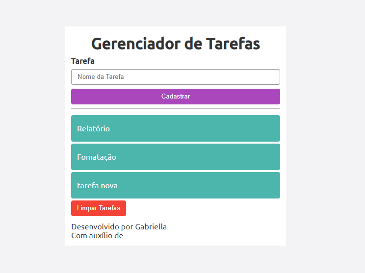

# ToDoList

# e-commerce
[e-commerce](#e-commerce-1)
[Descrição](#descri%C3%A7%C3%A3o)
[Introdução](#introdu%C3%A7%C3%A3o)
[Funcionalidades](#funcionalidades)
[Tecnologiasutilizadas](#tecnologias-utilizadas) 
[Fontesconsultadas](#fontes-utilizadas)
[Autores](#autores)

# e-commerce

# Descrição
Este é um simples gerenciador de tarefas desenvolvido em PHP, HTML e CSS. Ele permite que o usuário adicione tarefas, visualize uma lista delas e limpe a lista quando necessário. Este README fornecerá uma visão geral do código e como ele funciona.
# Introdução
Este é um simples gerenciador de tarefas desenvolvido em PHP, HTML e CSS. Ele permite que o usuário adicione tarefas, visualize uma lista delas e limpe a lista quando necessário. Este README fornecerá uma visão geral do código e como ele funciona.
# Funcionalidades
Adição de tarefas: Os usuários podem adicionar tarefas através do formulário fornecido na página.
Visualização de tarefas: As tarefas adicionadas são exibidas em uma lista na mesma página.
Limpeza de tarefas: Os usuários têm a opção de limpar todas as tarefas da lista.
# Tecnologias Utilizadas
PHP: Linguagem de programação utilizada para o desenvolvimento do backend.
- HTML: Linguagem de marcação para estruturar o conteúdo da página.
- CSS: Folhas de estilo em cascata para estilizar a interface do usuário.
- Google Fonts: Biblioteca de fontes utilizada para estilizar o texto da página.

# Fontes Utilizadas
As fontes utilizadas neste projeto são da família "Ubuntu", obtidas através do Google Fonts.
# Autores
Gabriella, Monolito com PHP
